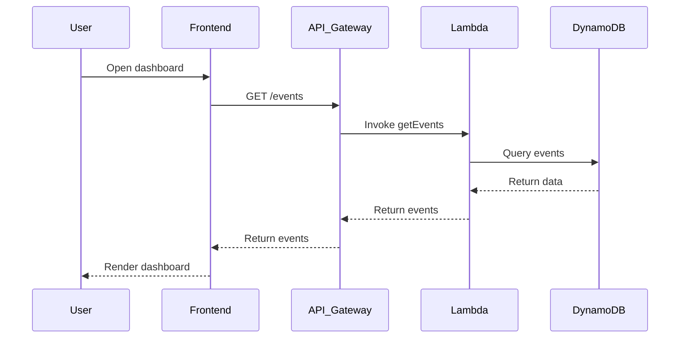

# Lambda/Data Flow Sequence

```mermaid
sequenceDiagram
    participant User
    participant Frontend
    participant API_Gateway
    participant Lambda
    participant DynamoDB
    User->>Frontend: Open dashboard
    Frontend->>API_Gateway: GET /events
    API_Gateway->>Lambda: Invoke getEvents
    Lambda->>DynamoDB: Query events
    DynamoDB-->>Lambda: Return data
    Lambda-->>API_Gateway: Return events
    API_Gateway-->>Frontend: Return events
    Frontend-->>User: Render dashboard
```
